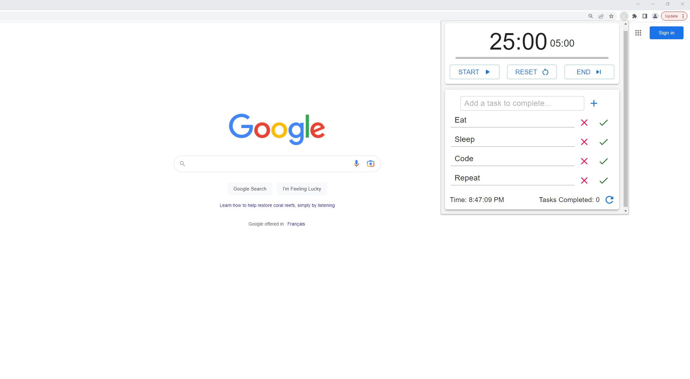
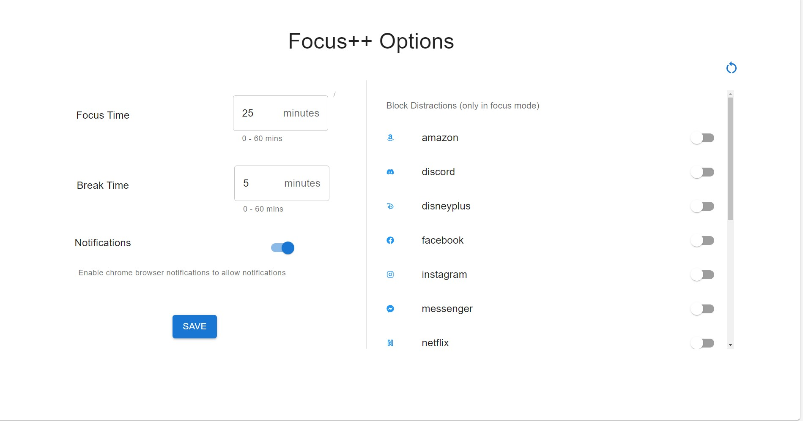
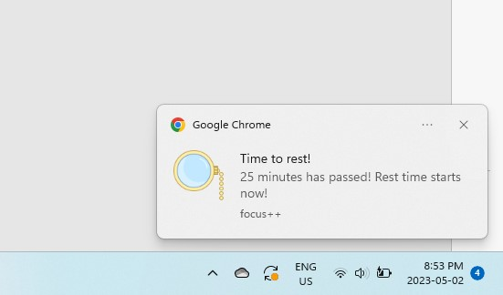

# Focus ++

Productivity Chrome Extension built using React, Typescript, MUI.
 
Distracted by social media? Losing focus in your work sessions? Want to keep track of your tasks for the day? This extension will remove distractions and help you get things done!
 

## Functionality

- Built in Pomodor Timer sessions
- Customise your focus and break time intervals (right click options)
- Create a task list to keep track of tasks to complete in your day
- Track the number of tasks you've completed
- Block up to 14 different social media and streaming sites while you're focusing!
- Get notified when your focus/rest time ends and start a new session!
   

## Preview

Extension PopUp
 

 
Options Page
 

 
Notification
 

 

## Test it out?

- Clone this repository into local directory
- Navigate to chrome://extensions on your local chrome browser
- Enable Developer mode
- Click on load unpacked and select the folder you cloned.
- Turn on chrome notifications for notifications to work properly (optional)
